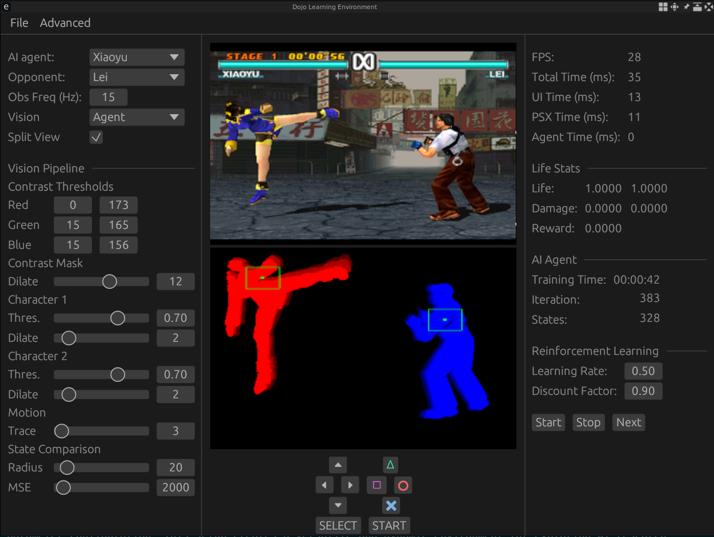
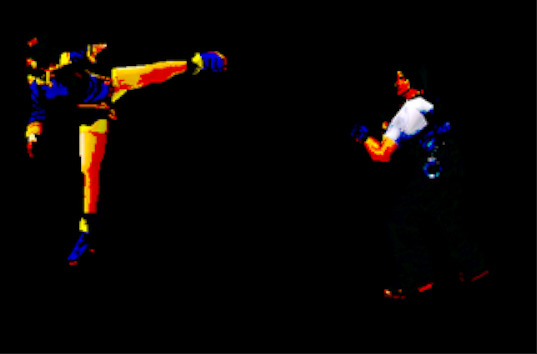
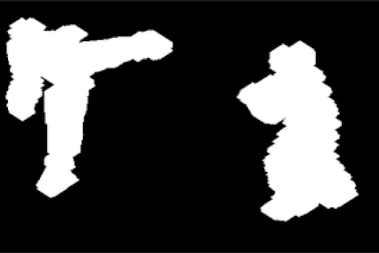
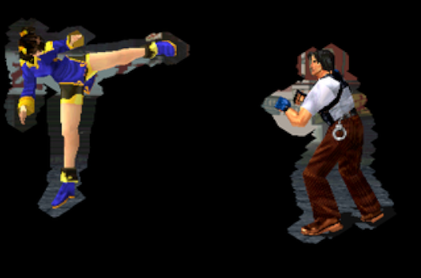
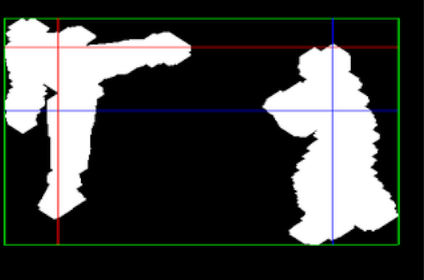
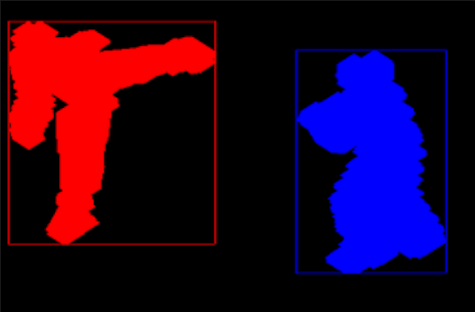
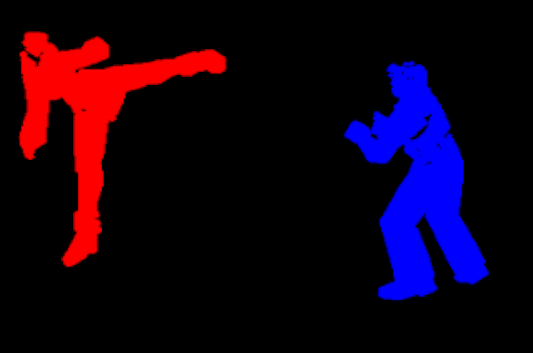

# Dojo Learning Environment

This project aims to develop a hobbyist platform for AI research, using a
well-known PSX fighting game as its foundation. The codebase for the PSX
emulator is derived from [rpsx](https://github.com/KieronJ/rpsx) and is fully
encapsulated within its own directory. On top of this emulator, the platform
integrates several components: a PSX GUI for seamless extraction of game states,
a vision pipeline to process and analyze frames, an AI agent to interact with
the game, and a comprehensive GUI application that enables interaction with the
system and real-time parameter configuration. This setup creates a versatile
and dynamic environment for exploring AI agents.

Another motivation for embarking on this project was to learn and gain
experience with Rust.

# Vision Pipeline

    
    
    

    
    
    

# AI Agent: Q Learning

# Quickstart

## Generate game states

## Run Dojo Learning Environment GUI

# Challenges

# Future work
