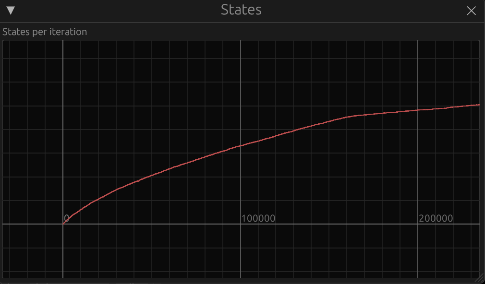
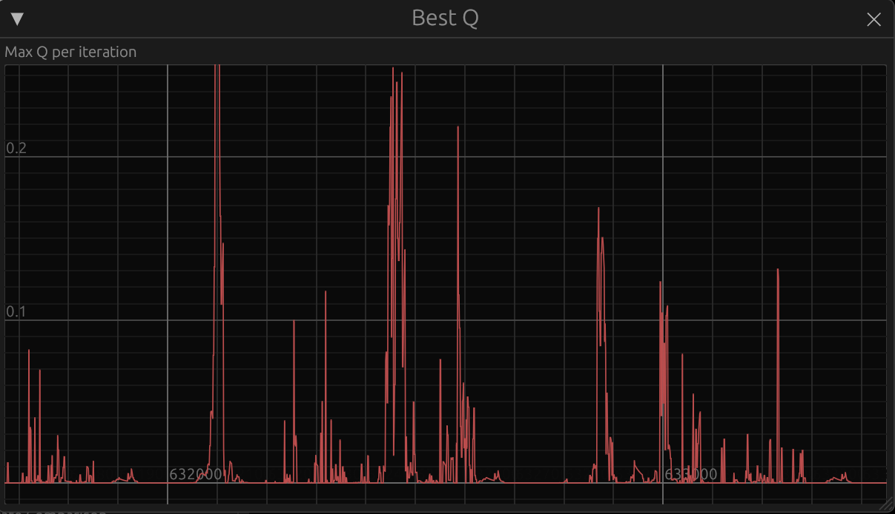

# Dojo Learning Environment

This project aims to develop a hobbyist platform for AI research, using a
well-known PSX fighting game as its foundation. The codebase for the PSX
emulator is derived from [rpsx](https://github.com/KieronJ/rpsx) and is fully
encapsulated within its own directory. On top of this emulator, the platform
integrates several components: a PSX GUI for seamless extraction of game states,
a vision pipeline to process and analyze frames, an AI agent to interact with
the game, and a comprehensive GUI application that enables interaction with the
system and real-time parameter configuration. This setup creates a versatile
and dynamic environment for exploring AI agents.

[](https://youtu.be/dN3Ic_XxZ3Y)

Another motivation for embarking on this project was to learn and gain
experience with Rust :crab:

# Vision Pipeline

The input information fed to the AI agent comes from the raw pixels of the
game frames, so it is fundamental to have a robust vision pipeline to produce
a manageable set of states.

Initial testing revealed that a rough extraction of the characters from the
background could be achieved using a contrast-based filter. Building on this,
we apply a series of image processing operations to identify both characters
and refine the segmentation.

<p align="middle">
    
    
    
</p>
<p align="middle">
    
    
    
</p>

# AI Agent: Q Learning

For this project, we apply Reinforcement Learning, specifically the Q-Learning
algorithm. Its essence can be captured by the following equation:

$$
Q(s, a) \leftarrow Q(s, a) + \alpha \left[ r + \gamma \max_{a'} Q(s', a') - Q(s, a) \right]
$$

- Q(s, a): The Q-value, representing the expected cumulative reward for
taking action **a** in state **s**
- $$\alpha$$: The learning rate, determining how much new information
overrides old information. This parameter is configurable via GUI
- r: The immediate reward received after taking action **a** in state
**s**. This is extracted from the life bars
- $$\gamma$$: The discount factor, which prioritizes immediate rewards over
future rewards. Parameter configurable via GUI
- $$\max_{a'} Q(s', a')$$: The maximum Q-value for the next state **s'**,
representing the best possible action from that state

The GUI application provides advanced functionality, including a plot of the
number of states per iteration, which is expected to converge over time.
Additionally, it shows the Q-value of the action chosen by the agent at each
iteration, which should be the maximum value.

<p align="middle">
    
    
</p>

# Quickstart

Getting started with this platform is straightforward. Just follow these
simple steps:

## Generate game states

To train the agent, you’ll need game states, a BIOS, and a game rom. For
legal reasons, this project does not provide the BIOS, game image, or
pre-generated states.

However, a convenient tool called **psx-gui** is included. This application runs
the emulator with a graphical user interface, allowing you to easily save (and
load) emulator states.

To launch the `psx-gui` application, use the following command:

```
cargo run --release --bin psx-gui <bios-path> <rom-path>
```

Ideally, these states should represent the start of a combat scenario and be
named following the pattern:

```
<char1>_vs_<char2>.bin
```

Save these files in the `states/` directory.

## Run Dojo Learning Environment GUI

You are now ready to launch the main GUI, which provides controls for managing
the training process.

```
cargo run --release --bin dojo-learning-environment-gui
```

Using the GUI, you can `Start` and `Stop` training or step through the process
incrementally using the `Next` button.

Take some time to explore the GUI and discover its full functionality. One
interesting feature is the ability to pause on specific states and inspect the
various stages of the vision pipeline for deeper insights. You should be able
to observe the buttons pressed by the agent (action) in the bottom panel.

As mentioned above, under the `Advanced` section, you can monitor plots that
display:

 - The convergence of the number of states.
 - The Q-values of actions selected during training.

## Save/Load agents

Training the agent can be time-consuming, so it’s crucial to save the current
agent's progress to resume training later. This functionality is accessible
through the menu options:

- `File > Save Agent`: Save the agent's current state.
- `File > Load Agent`: Reload a previously saved agent to continue training.

# Challenges

The primary challenge of this project was designing an effective frame
abstraction that could reliably identify previously visited states. This was
critical to ensuring the number of unique states eventually converged to a
reasonable level. Overcoming this challenge led to significant improvements in
the vision pipeline.

Note that certain characters and scenarios can significantly increase
segmentation difficulty, and fine-tuning the vision pipeline parameters would
be necessary to achieve optimal results.

# Future work

Research suggests that for complex vision-based problems like this, a more
effective approach might involve Deep Reinforcement Learning. Deep Neural
Networks (DNNs) can assist in abstracting and identifying relevant states more
effectively. As a potential next step, adding an agent that implements the
Deep Q-Learning algorithm could be a promising direction for further
development.
